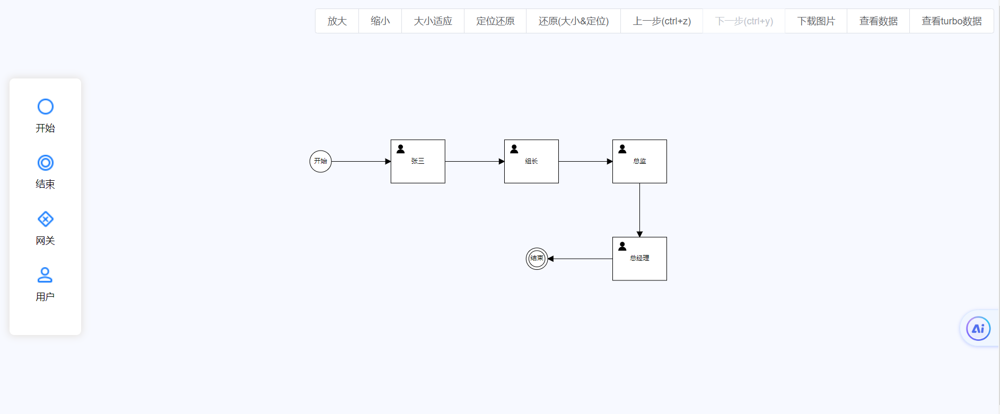

## 说明
基于logicflow流程引擎做的一个快速上手的流程设计器demo

## 预览
地址：https://zh888.gitee.io/logicflow-vue-bpm-demo-ing/#/

## 截图


## Project setup
```
yarn install
```

### Compiles and hot-reloads for development
```
yarn serve
```

### Compiles and minifies for production
```
yarn build
```

### Lints and fixes files
```
yarn lint
```

### Customize configuration
See [Configuration Reference](https://cli.vuejs.org/config/).
